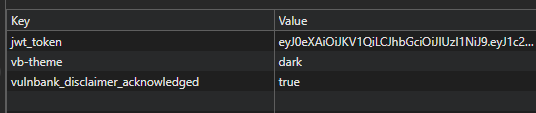

# Token stored in localStorage
Aplikacja przechowuje token JWT w localStorage, co zwiększa ryzyko przejęcia tokena.

## Reprodukcja:
Zalogować się do aplikacji.
Otworzyć DevTools → Application → Local Storage.
Zweryfikować obecność tokena.

## Rezultat:
Widoczny jwt_token wraz z jego wartością.

