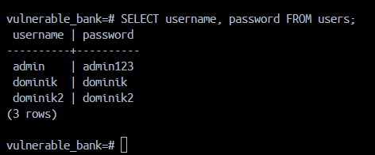

# Vulnerability Report: Plaintext Password Storage

**Target Application:** Vuln-Bank (Localhost)
**Author:** Dominik
**Date:** 18.03.2026

---

## 1. Overview

Wykryto krytyczna podatnosc polegajaca na przechowywaniu hasel uzytkownikow w postaci jawnej (plaintext). Aplikacja nie stosuje mechanizmow haszowania ani zabezpieczen kryptograficznych, co prowadzi do bezposredniego ujawnienia danych uwierzytelniajacych w bazie danych.

---

## 2. Identified Vulnerability

### 2.1 Plaintext Password Storage

* **Opis:** Hasla uzytkownikow sa przechowywane w bazie danych w formie niezaszyfrowanej (plaintext).
* **Co jest nie tak:** Brak zastosowania bezpiecznych funkcji haszujacych (np. bcrypt, Argon2) oraz brak polityki ochrony danych uwierzytelniajacych.
* **Ryzyko:** Atakujacy, ktory uzyska dostep do bazy danych, moze natychmiast odczytac hasla i wykorzystac je do przejecia kont lub atakow na inne systemy.

---

## 3. Proof of Concept (PoC)

### 3.1 Test - Odczyt hasel z bazy danych

1. Uruchomic aplikacje w srodowisku Docker.
2. Otworzyc kontener bazy danych (`db-1`) w Docker Desktop.
3. Przejsc do zakladki **Exec** i uruchomic klienta PostgreSQL:

```bash
psql -U postgres
```

4. Wyswietlic dostepne bazy danych:

```sql
\l
```

5. Polaczyc sie z baza aplikacji:

```sql
\c vulnerable_bank
```

6. Wyswietlic dostepne tabele:

```sql
\dt
```

7. Wykonac zapytanie:

```sql
SELECT username, password FROM users;
```

---

## 4. Result

Aplikacja przechowuje hasla w postaci jawnej (plaintext), co zostalo potwierdzone bezposrednim odczytem z bazy danych:


---

## 5. Wnioski

* mozliwosc natychmiastowego przejecia kont uzytkownikow
* brak ochrony danych w przypadku wycieku bazy danych
* naruszenie poufnosci informacji uwierzytelniajacych
* mozliwosc wykorzystania hasel w innych systemach (credential reuse)

Podatnosc **Plaintext Password Storage** zostala potwierdzona. Aplikacja nie zapewnia podstawowego poziomu ochrony danych uwierzytelniajacych, co stanowi krytyczne ryzyko bezpieczenstwa. Wymagane jest natychmiastowe wdrozenie bezpiecznych mechanizmow haszowania hasel oraz eliminacja przechowywania danych w postaci jawnej.
