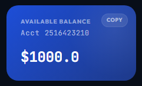
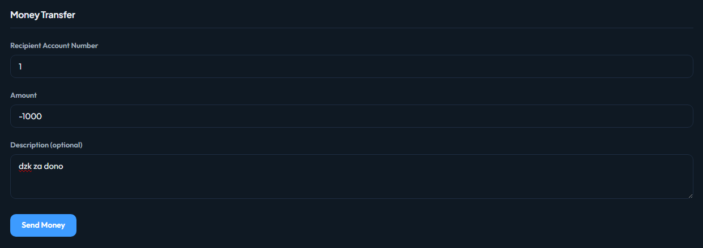
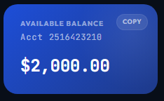

# Negative amount transfers possible
Endpoint przelewu akceptuje ujemna kwote i wykonuje transakcje.

## Reprodukcja:
1. Zalogowac sie na konto. Stan konta przed operacja:

2. Wyslac przelew na kwote ujemna.

Stan konta po operacji:

## Rezultat:
Mamy dodatkowe srodki na koncie wykonujacym przelew.
