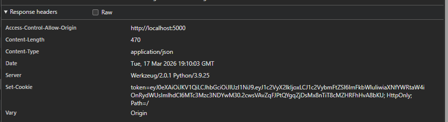

# Token Exposure in URLs

## Opis:
Aplikacja przekazuje tokeny uwierzytelniające (np. JWT, session ID) w parametrze URL zamiast w nagłówkach HTTP. Takie podejście naraża token na przechwycenie, zapis w logach serwera, historii przeglądarki lub przez proxy, co może umożliwić atakującemu dostęp do kont użytkowników.

## Reprodukcja:
1. Zalogować się do aplikacji.
2. Otworzyć DevTools (F12) → zakładka **Network**.
3. Zidentyfikować żądania, w których token jest przekazywany w URL i zobaczyć token

## Rezultat:
- Token jest widoczny w URL i może zostać zapisany w:
  - historii przeglądarki
  - logach serwera
  - logach proxy lub systemu CDN
- Umożliwia to przejęcie sesji lub dostęp do konta, jeśli token zostanie przechwycony.
