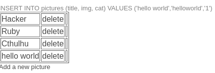

## mozemy dodawac pliki

Przesłano plik zawierający PHP:

```php
<?php
    echo 'Hello World!';
?>
```



- .phtml — alternatywne rozszerzenie plików PHP.  
- .php3, .php4, .php5 — starsze wersje (rzadko używane obecnie).  
- .inc — pliki dołączane (często zawierają PHP); powinny być chronione przed bezpośrednim dostępem przez WWW.  
- .html lub .htm — mogą zawierać kod PHP, jeśli serwer jest tak skonfigurowany (np. przez Apache AddType/AddHandler lub przez .htaccess przekazujący .html do interpretera PHP).

Dziala php3

```
http://vulnerable/admin/uploads/helloworld.php3
```

Wyswietlilo sie hello world

TODO: dziwne
The filename should only contains between 3 to 8 letters

TODO: exec shell from php

TODO: get everything from shell