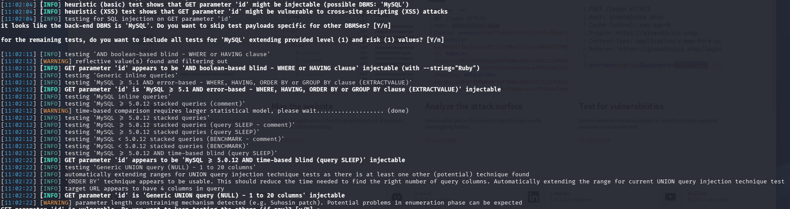

# Analiza strony za pomocą narzędzia sqlmap

## Cel testów
Weryfikacja podatności SQL Injection oraz ekstrakcja danych z aplikacji webowej.

## Wykonanie

Użycie komendy
```
sqlmap -u "https://192.168.X.X/cat.php?id=1" --dbs
```
Gdzie za X należy podstawić adres IP maszyny wirtualnej w sieci

## Wyniki



## Wstępna analiza

W trakcie testów stwierdzono, że parametr `id` jest podatny na SQL Injection.

### Typy SQL Injection

### 1. Boolean-based blind SQL Injection
- Podatna na klauzle WHILE lub HAVING

---

### 2. Error-based SQL Injection
- Wykryto podatność poprzez funkcję EXTRACTVALUE
- Typ bazy danych: MySQL > 5.1

---

### 3. Time-based blind SQL Injection
- Wykorzystuje funkcję SLEEP()
- Dane ekstraktowane poprzez opóźnienia w odpowiedzi serwera

---

### 4. UNION-based SQL Injection
- Wykryto możliwość użycia UNION SELECT
- Liczba kolumn: 1 – 20

---

### 5. Stacked queries (częściowo dostępne)
- Wykryto możliwość wykonywania wielu zapytań SQL
- Potencjalnie umożliwia eskalację ataku

---

## Informacje o bazie danych

- DBMS: MySQL
- Wersja: > 5.0.12

---
