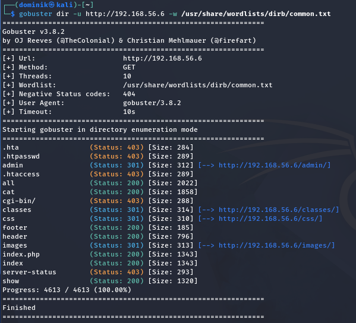

# PHP File Upload – Eskalacja dostępu do Remote Code Execution

## Cel testów
Weryfikacja podatności na niewalidowany upload plików oraz eskalacja dostępu do Remote Code Execution (RCE) poprzez wgranie powłoki PHP.

---

## Wstęp

Z poprzednich testów wynika, że:
- Uzyskaliśmy dostęp do panelu administracyjnego
- Panel administracyjny zawiera funkcjonalność uploadu plików
- W bazie danych znaleźliśmy wpis `reversedphp:shell.php3` wskazujący na wcześniejszy upload

---

## Wykonanie

### Krok 1: Analiza funkcjonalności uploadu

Panel administracyjny udostępnia możliwość dodawania nowych zdjęć, które są przechowywane w bazie danych i na serwerze plików.

---

### Krok 2: Upload powłoki PHP

Stworzono prosty plik PHP:

```php
<?php
    echo 'Hello World!';
?>
```



Plik został pomyślnie wgrany do systemu.

---

## Alternatywne rozszerzenia plików PHP

Serwer Apache rozpoznaje wiele rozszerzeń jako pliki PHP:

| Rozszerzenie | Opis | Status |
|---|---|---|
| `.php` | Domyślne rozszerzenie PHP | Zazwyczaj zatwierdzone |
| `.phtml` | Alternatywne rozszerzenie | Może działać |
| `.php3` | PHP 3 (legacy) | **Działa** |
| `.php4` | PHP 4 (legacy) | Może działać |
| `.php5` | PHP 5 (legacy) | Może działać |
| `.inc` | Pliki include | Może działać |
| `.html`/`.htm` | HTML z PHP | Może działać (jeśli skonfigurowany) |

### Testowanie alternatywnych rozszerzeń

Użycie rozszerzenia `.php3` umożliwia obejście podstawowych filtrów:

```
GET http://192.168.56.6/admin/uploads/helloworld.php3
```

**Wynik:**
```
Hello World!
```


Powłoka PHP została wykonana, co potwierdza Remote Code Execution.

---

## Ograniczenia systemu

Serwer implementuje podstawową walidację:
- **Ograniczenie długości nazwy:** `3 do 8 znaków`
- **Brak walidacji rozszerzenia:** Nie sprawdza rzeczywistego typu pliku
- **Brak sandbox:** Pliki są wykonywane w kontekście użytkownika www-data

---

## Ryzyko i wpływ

### Remote Code Execution (RCE)

Po wgraniu powłoki PHP atakujący może:
- Wykonywać dowolne polecenia systemowe
- Czytać i modyfikować pliki na serwerze
- Dostęp do systemowej bazy danych
- Potencjalna ekspansja na inne serwery w sieci

### Zagrożenia:

1. **Pełna kompromitacja serwera** – RCE jako www-data
2. **Kradzież danych** – Dostęp do plików aplikacji
3. **Defacement** – Modyfikacja zawartości strony
4. **Malware distribution** – Rozpowszechnianie złośliwego oprogramowania
5. **Lateral movement** – Ekspansja ataku na inne systemy

---

## Rekomendacje bezpieczeństwa

1. **Walidacja rozszerzeń plików:**
   ```php
   $allowed = ['jpg', 'jpeg', 'png', 'gif'];
   $ext = strtolower(pathinfo($_FILES['file']['name'], PATHINFO_EXTENSION));
   if (!in_array($ext, $allowed)) { die('Invalid file type'); }
   ```

2. **Walidacja MIME type:**
   ```php
   $mime = mime_content_type($_FILES['file']['tmp_name']);
   if (!in_array($mime, ['image/jpeg', 'image/png', 'image/gif'])) {
       die('Invalid MIME type');
   }
   ```

3. **Przechowywanie plików poza web root:**
   ```php
   move_uploaded_file($_FILES['file']['tmp_name'], '/var/secure/uploads/' . $filename);
   ```

4. **Wymuszenie pobierania zamiast wykonywania:**
   ```apache
   <Directory "/var/www/uploads">
       php_flag engine off
       AddType text/plain .php .php3 .php4 .php5 .phtml
   </Directory>
   ```

5. **Losowa zmiana nazwy pliku:**
   ```php
   $filename = bin2hex(random_bytes(16)) . '.jpg';
   ```

6. **Monitorowanie uploadu** – Logowanie wszystkich wgrywanych plików


