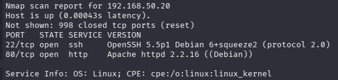

# Analiza strony za pomocą narzędzia nmap

## Cel testów
Identyfikacja aktywnych hostów w sieci lokalnej oraz wykrycie otwartych portów i usług w celu wstępnej analizy powierzchni ataku.

## Wykonanie

Użycie komendy
```
nmap -T4 -sV 192.168.X.X
```
Gdzie za X należy podstawić adres IP maszyny wirtualnej w sieci

## Wyniki



## Wstępna analiza

W trakcie testów wykryto aktywne usługi sieciowe na analizowanym hoście. System odpowiedział na zapytania skanera, co potwierdza jego dostępność w sieci lokalnej.

### Wykryte otwarte porty i usługi

### 1. Port 22/tcp – SSH
 - Usługa: OpenSSH
 - Wersja: 5.5p1 Debian 6+squeeze2 (protocol 2.0)
 - Status: open
---

### 2. Port 80/tcp – HTTP
- Usługa: serwer WWW (Apache)
- Wersja: httpd 2.2.16 (Debian)
- Status: open

---
