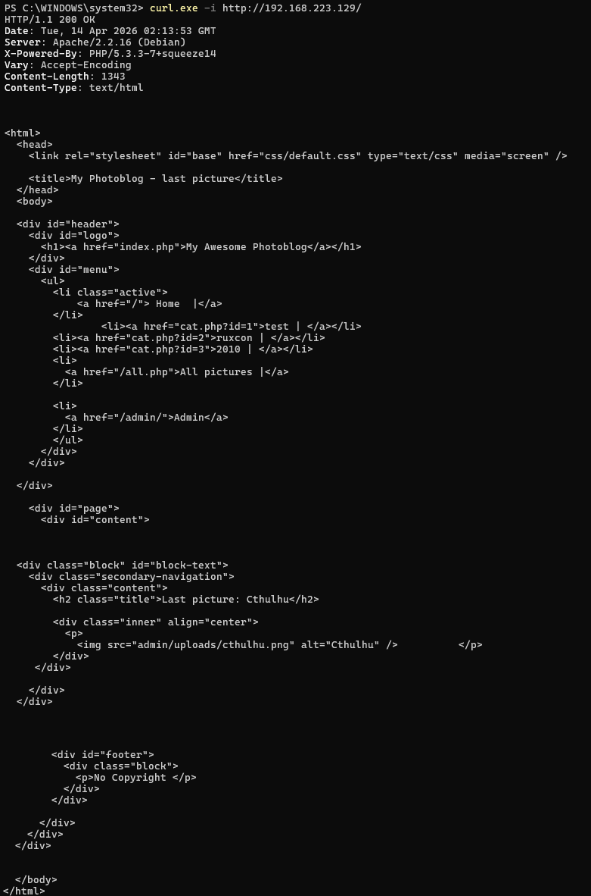
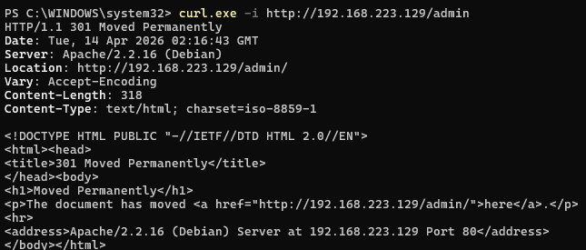
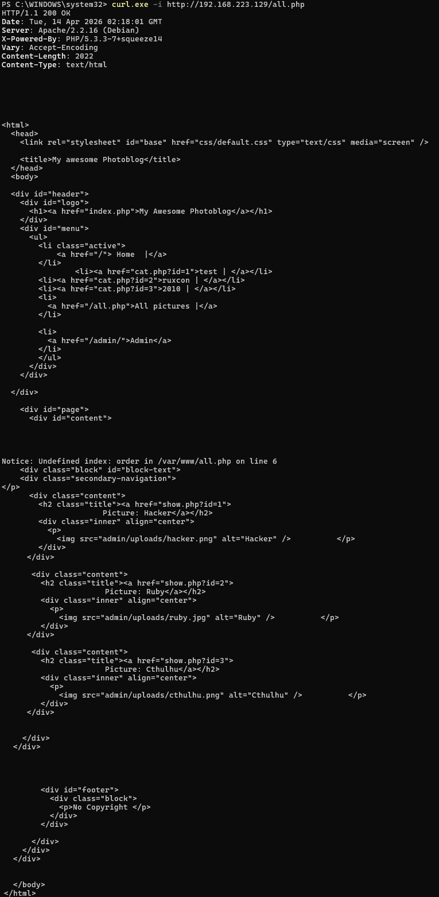
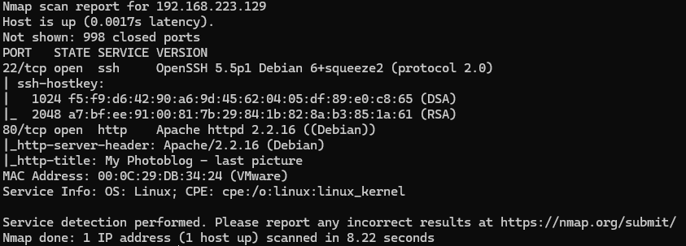
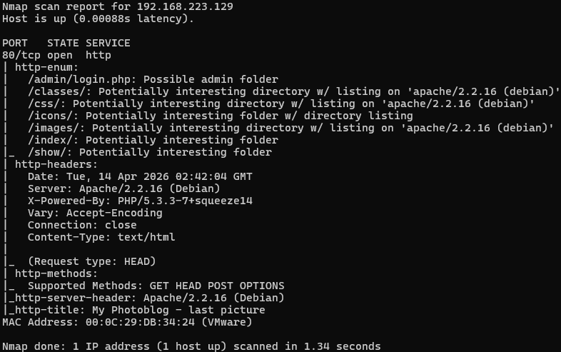
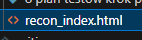

# Inspecting HTTP headers

## Cel
Identyfikacja ujawnianych informacji o technologii, konfiguracji HTTP i bledow aplikacji na podstawie odpowiedzi serwera.

## Wykonanie
```powershell
curl.exe -i http://vulnerable/
curl.exe -i "http://vulnerable/all.php"
curl.exe -i http://vulnerable/admin
```







## Wyniki
1. Endpoint glowny zwraca status 200 OK.
2. Endpoint all.php zwraca status 200 OK.
3. Endpoint admin zwraca 301 Moved Permanently z przekierowaniem do /admin/.
4. Serwer ujawnia wersje oprogramowania:
	- Server: Apache/2.2.16 (Debian)
	- X-Powered-By: PHP/5.3.3-7+squeeze14
5. Brak widocznych security headers (m.in. X-Frame-Options, X-Content-Type-Options, Content-Security-Policy, Strict-Transport-Security, Referrer-Policy).
6. W all.php widoczny jest komunikat bledu aplikacji:
	- Notice: Undefined index: order in /var/www/all.php on line 6

## Interpretacja ryzyka
- Information disclosure: ujawnienie wersji Apache i PHP ulatwia dopasowanie exploitow.
- Error disclosure: ujawnienie sciezki pliku i szczegolu bledu pomaga w dalszej enumeracji aplikacji.
- Header hardening gap: brak podstawowych naglowkow bezpieczenstwa zwieksza ekspozycje aplikacji WWW.

## Rekomendacje
1. Ukryc wersje serwera i PHP w naglowkach odpowiedzi.
2. Wylaczyc wyswietlanie bledow PHP w odpowiedziach HTTP i logowac je tylko po stronie serwera.
3. Dodac security headers:
	- X-Frame-Options
	- X-Content-Type-Options
	- Content-Security-Policy
	- Strict-Transport-Security (po wdrozeniu HTTPS)
	- Referrer-Policy
4. Wymusic stale przekierowanie do kanonicznych URL oraz docelowo HTTPS.

# Gruntowny recon web + fingerprint technologii

## Cel
Identyfikacja aktywnych uslug i wstepny fingerprint aplikacji webowej w celu przygotowania dalszych testow.

## Wykonanie
1. Skan uslug i wersji.
```powershell
nmap -sC -sV vulnerable
```
2. Fingerprint technologii web.
```powershell
nmap -p80 --script http-title,http-server-header,http-headers,http-methods,http-enum vulnerable
```
3. Pobierz kod strony glownej i zapisz do pliku.
```powershell
curl.exe -s http://vulnerable/ | Tee-Object -FilePath recon_index.html
```







## Wyniki
1. Host odpowiada i udostepnia usluge HTTP na porcie 80.
2. Skan HTTP ujawnia szczegoly odpowiedzi serwera i charakterystyke aplikacji.
3. Kod strony glownej zostal zapisany do pliku `recon_index.html` i moze byc wykorzystany do dalszej analizy endpointow i parametrow.

## Interpretacja ryzyka
- Recon confirmed: cel jest dostepny sieciowo i gotowy do dalszych testow warstwy web.
- Information disclosure: odpowiedzi HTTP wspieraja fingerprint technologii i dobór kolejnych technik ataku.
- Attack surface mapping: zapisany HTML ulatwia mapowanie linkow, formularzy i potencjalnych punktow wejsciowych.

## Rekomendacje
1. Ograniczyc ujawnianie metadanych uslug i wersji oprogramowania.
2. Monitorowac skanowanie i anomalia ruchu HTTP w logach.
3. Wdrozyc hardening konfiguracji web serwera przed kolejnymi etapami testow.

